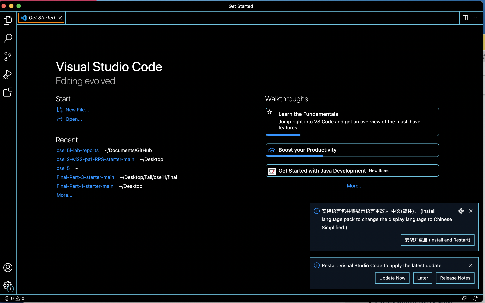

report1

First, we downloaded and installed Visual Studio Code.
My computer is MAC.

Second, we connect to a remote computer over the Internet to do work there.
I typed my course-specific account and entered my password.
This is the screenshot showing that I have successfully connected.

Then, I tried to run some commands.
I ran: ls, ls -a, ls -lat

Then, I used scp to move files over SSH.
After login into my account, the directory is formed and the code can be run.

Here is the screenshot of using ssh to store public key on the server, and the private key in a  on the client. 
Then we can use the public key to log in without password.

This is the screenshot of running a certain command.
By doing so, there is no need to seperate the commands into different steps.

