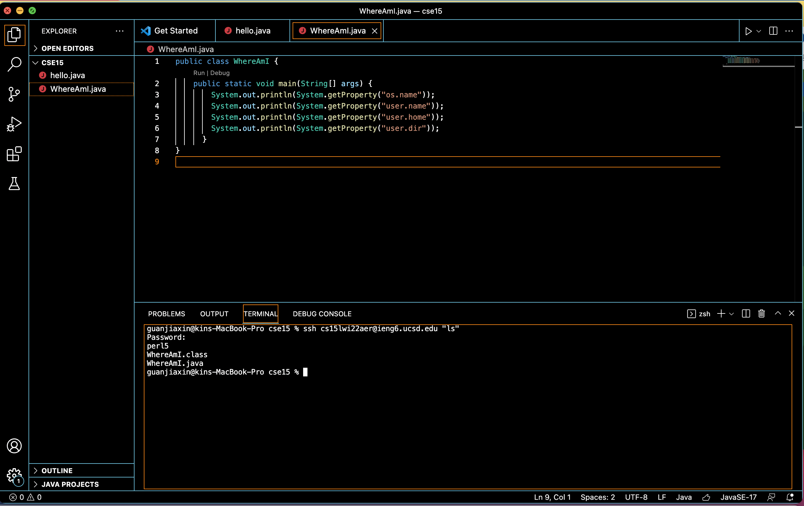

report1

**Installing VScode**

First, we downloaded and installed Visual Studio Code from [link1](vsc webpage)

My computer is MAC.

**Remotely Connecting**

Second, we connect to a remote computer over the Internet to do work there.
I typed my course-specific account and entered my password.

This is the screenshot showing that I have successfully connected.

**Trying Some Commands**

Then, I tried to run some commands.
I ran: ls, ls -a, ls -lat

And this is the screenshot of the terminal

**Moving Files with scp**

Then, I used scp to move files over SSH.

After login into my account, the directory is formed and the code can be run.

**Setting an SSH Key**
We use the ssh-keygen command to make a public private key pair for ease of login to the remote computer 

Here is the screenshot of using ssh to store public key on the server, and the private key in a  on the client. 
Then we can use the public key to log in without password.

**Optimizing Remote Running**

This is the screenshot of running a certain command.

By doing so, there is no need to seperate the commands into different steps.

