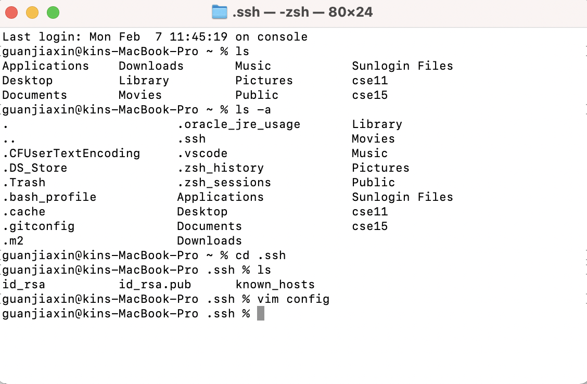
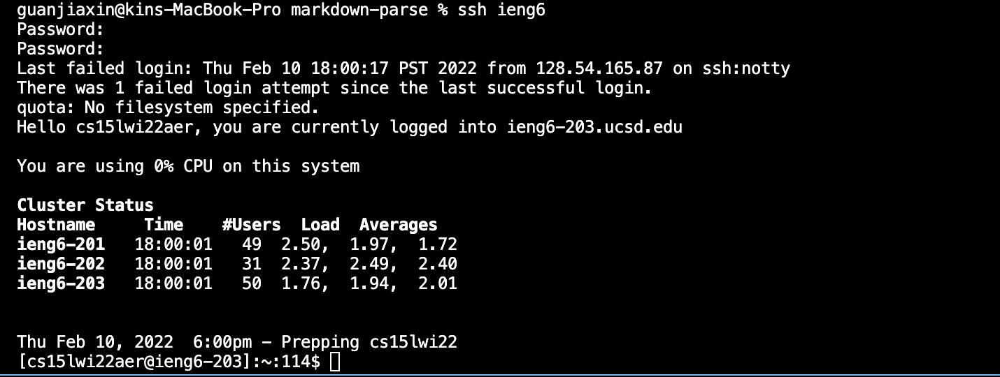
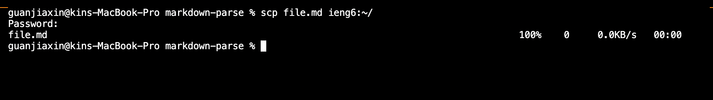
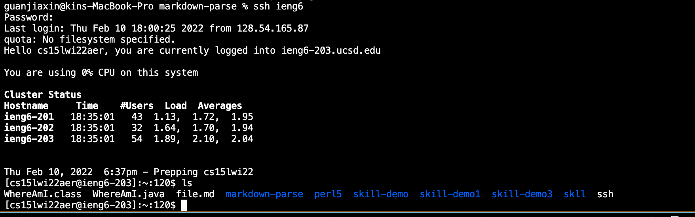

** Streamlinging ssh Configuration**

First, we need to create a config file in "~/.ssh/config" to what is the user name to use.

I copy and paste the following into my termianal on computer, my computer is MAC

Host ieng6
    HostName ieng6.ucsd.edu
    User cs15lwi22aer (use your username)

As shown in the picture below, this is the final result shown in my terminal
 

ieng6 is the alias I use, we can actually change it into anything we like.

Then, we can log into the server by using: ssh ieng6

Here the alias "iengs" replace the "cse15lwi22aer@ieng6.ucsd.edu"

To copy a file using scp command, we should type the long user name in the past.

This time, we can just use "iengs"

Finally, we log into the server again and use ls command line to list all the files.

As shown above, the file is copied wihtout typing the long username, which saves time and avoids typos.