**Lab Report 4**

[my repository](https://github.com/clemialgm/markdown-parse)

[the repository I reviewed](https://github.com/zfxd/markdown-parse)

**Snippet 1**

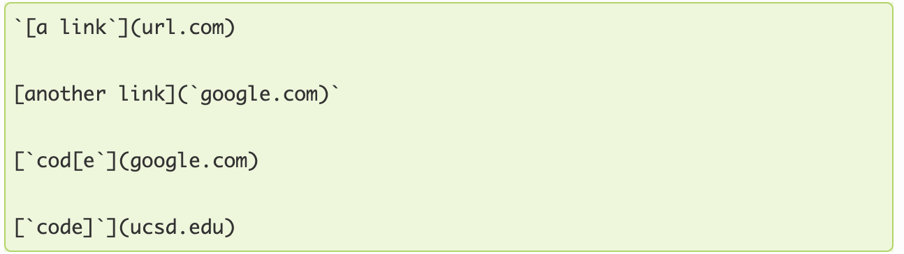

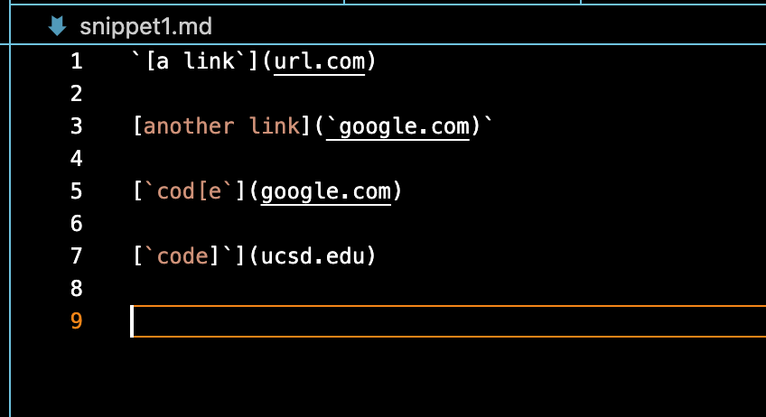

This is the test for the first snippet:
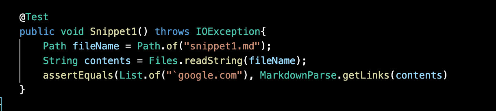

This is the output of this test for my implementation:
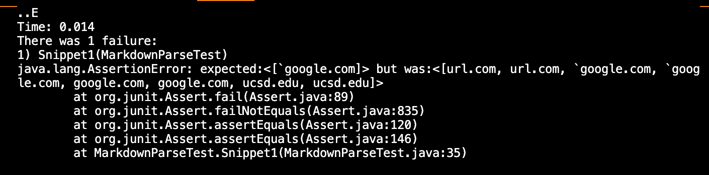

This is the output of the test for the implementation I reviewed:
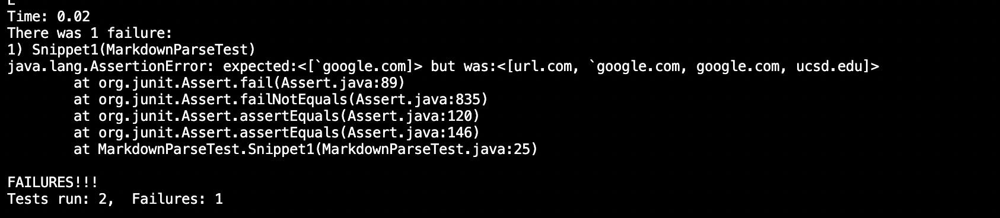

**Snippet 2**

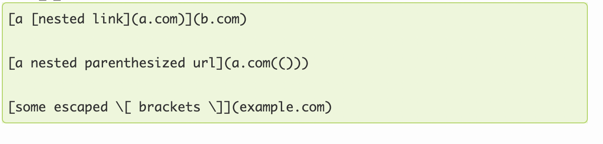

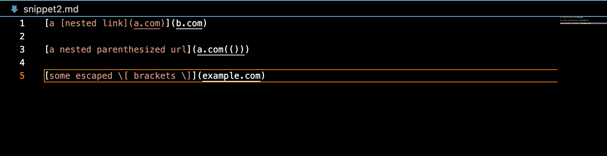

This is the test for the second snippet:
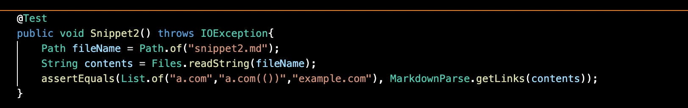

This is the output of this test for my implementation:
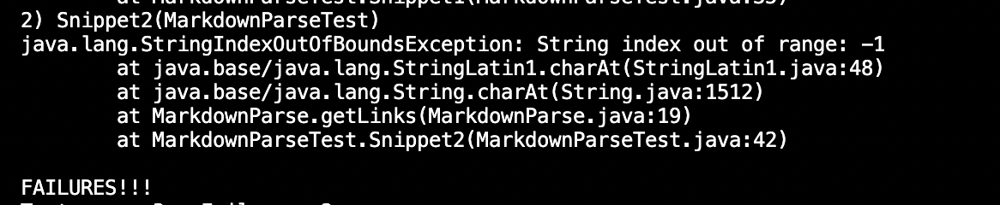

This is the output of the test for the implementation I reviewed:
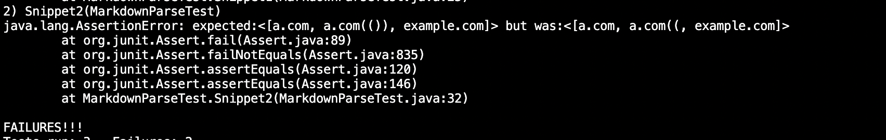

**Snippet 3**

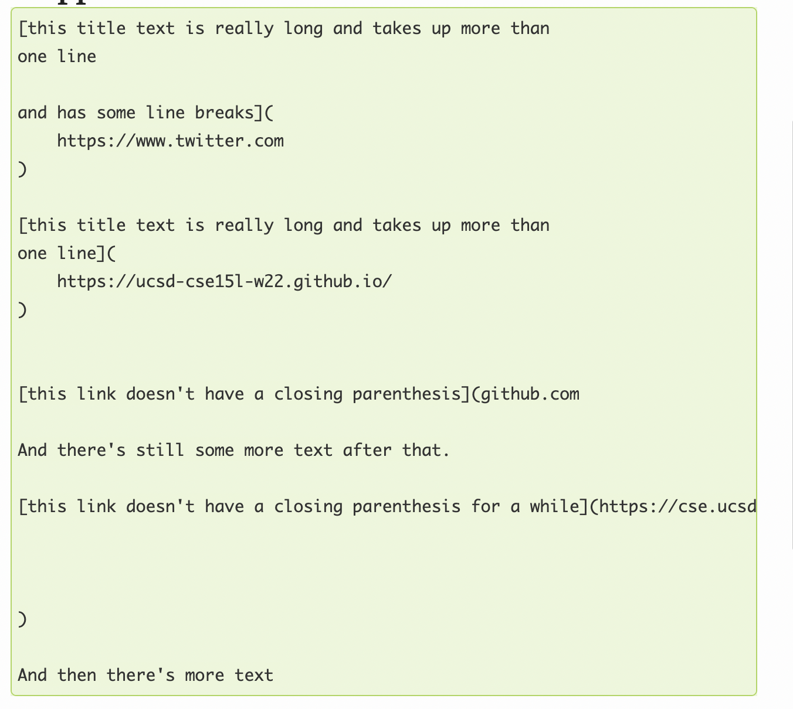

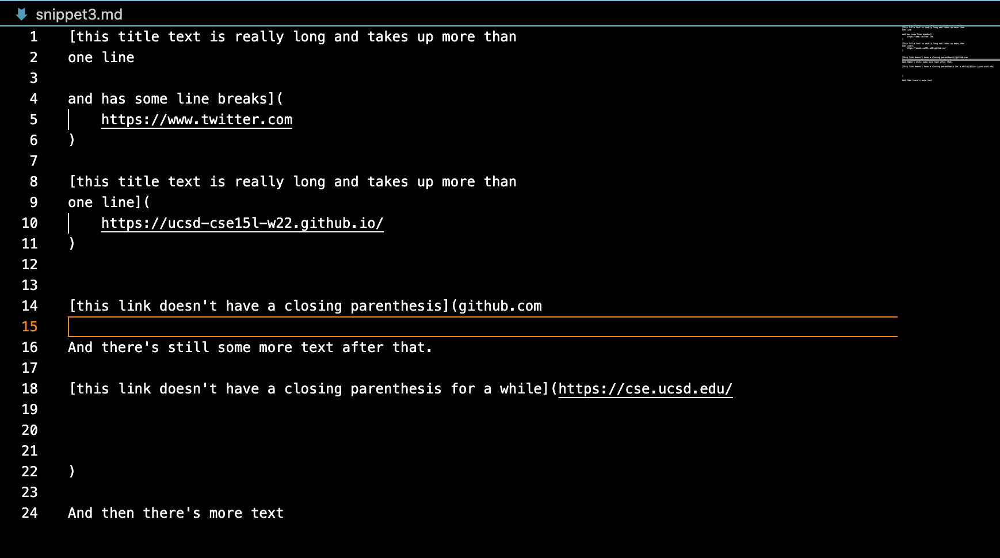

This is the test for the third snippet:
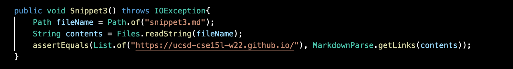

This is the output of this test for my implementation:
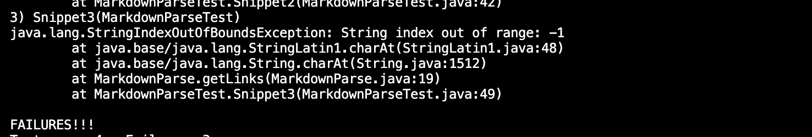

This is the output of the test for the implementation I reviewed:
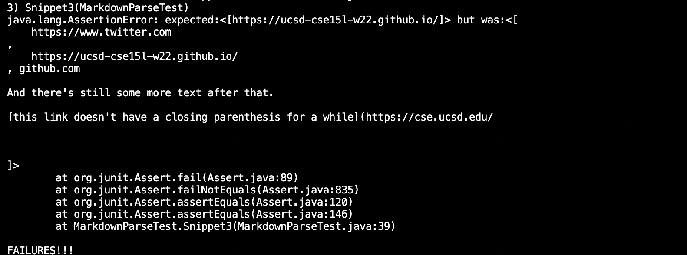

**code change for each snippet**

*snippet 1*

I think there should be a small code change. To filter the text in the parentheses and
list all the links, it may be helpful to create new variables for the backticks
that indicates the beginning and end of the code. Because this may help the program 
to keep the code out of the links returned. That means we should make the code to check 
the backticks and skip over the code between them.

*snippet2*

I think there should be a small code change. Because there is an IndexOutOfBoundsException,
what we need to do is just change the scope of certain variables to make sure the index
is in the range and print the links.

*snippet3*

I think there should be a small code change. This is also an IndexOutOfBoundsException.
The bug occurs at line19, where the scope of the nextOpenBracket should be changed.
I can just delete the "-1" to make it in the range.