**Report 5**

First, we have two txt files, 

one for the implementation of Joe's markdown-parse, 

one for the implementation of my markdown-parse

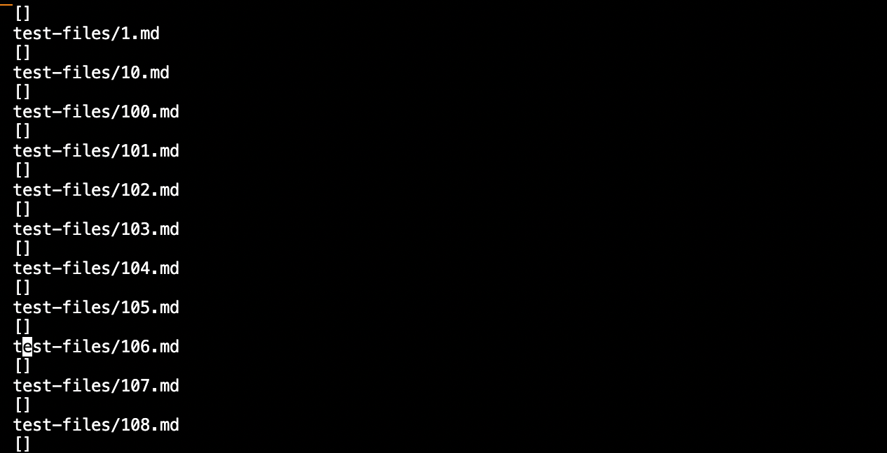

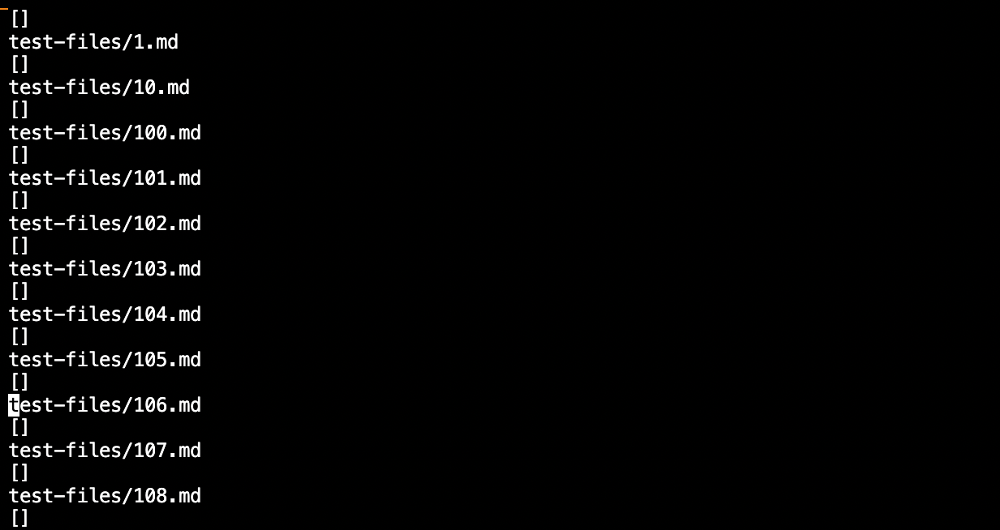

Then, we use diff to find out the differences between the two txt.files

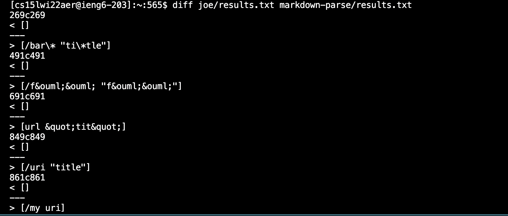

Then, we pick two tests that have different output to fix.

To make it more easy to find the lines in the txt.file,
I copied and pasted the content in the two txt.file in local txt.files.

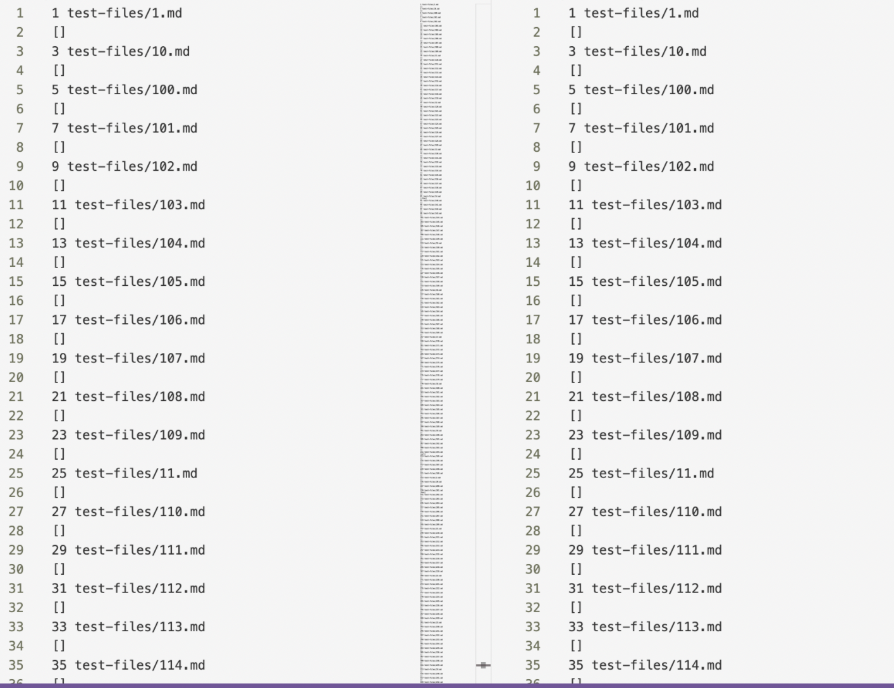

**test1**

The first test is:

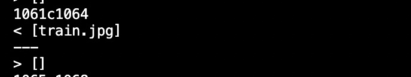

It is in 577.md
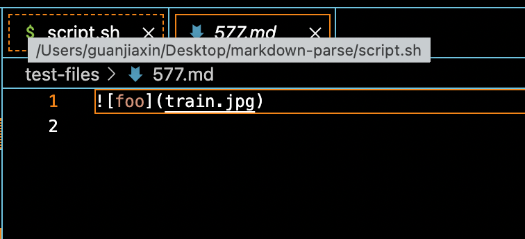

Because it is an image, we should not print it out, my implementation is correct.
Let's fix Joe's code.
Because Joe's code prints out the image,
we should just check the symbol "!".
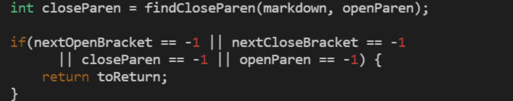

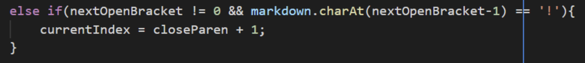

**test2**

The second test is:

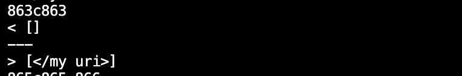

It is in 488.md

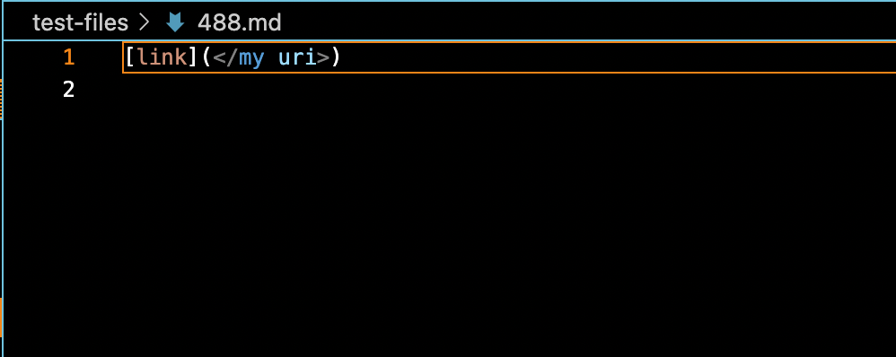

Because it has a reasonable link, we should print it out.

Because Joe's code doesn't print it out, while my code works,

we should make some changes to Joe's code.

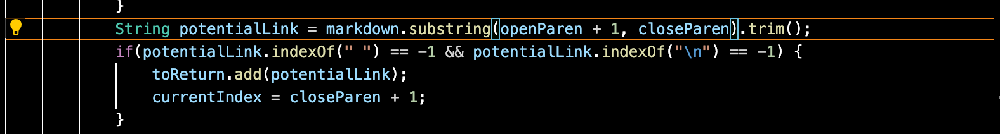
In this code, it checks whether there is space in the parentheses.

If it does, it will print. Otherwise, it will print nothing.

However, there is no spaces in</my uri>, but it is indeed a leagal link.

So, we should add an if statement to check if there there is spaces in 

the symbol "<>". 

If it does, we should add the potentialLink to toReturn.